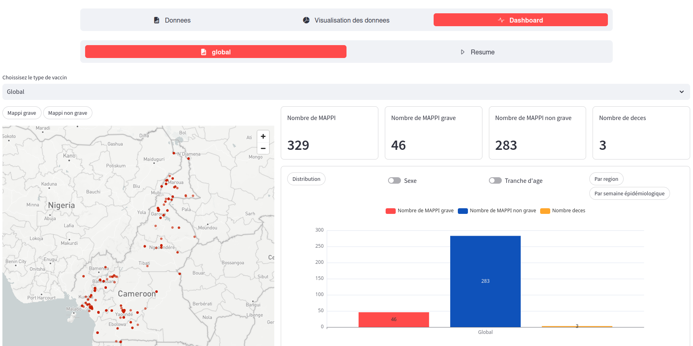
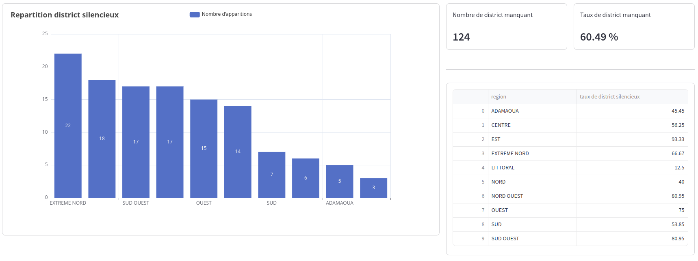
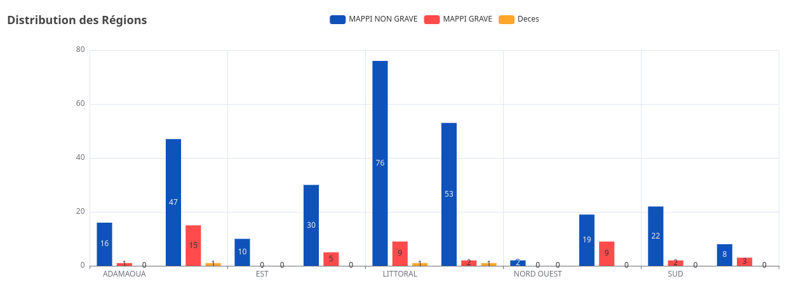
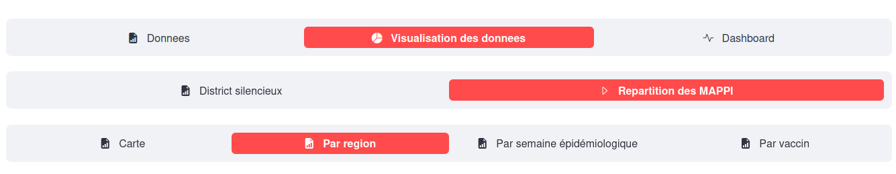

# Dashboard – Visualisation et Suivi des Données MAPPI

Ce projet propose un tableau de bord interactif développé avec Streamlit pour la visualisation, l'analyse et le suivi des données MAPPI (Manifestations Adverses Post-Immunisation) au Cameroun. Il permet d'explorer les données par région, district, vaccin, tranche d'âge, sexe, et période épidémiologique.

---

## Features Fonctionnalités

- **Importation automatique des données** depuis Dropbox.
- **Nettoyage et filtrage interactif** des données.
- **Visualisation avancée** : graphiques dynamiques (barres, camemberts, cartes).
- **Analyse par région, district, vaccin, sexe, tranche d'âge, semaine épidémiologique**.
- **Détection des districts silencieux** (sans déclaration).
- **Indicateurs clés** : nombre de MAPPI, gravité, décès, taux d'abstention, etc.

---

## Structure Structure du projet

```
Dashboard/
├── app.py                # Point d'entrée Streamlit
├── pages/
│   ├── Data.py           # Importation et nettoyage des données
│   ├── Visualisation.py  # Visualisation détaillée
│   └── Dashboard.py      # Synthèse et indicateurs globaux
├── data/
│   ├── data.xlsx         # Données principales (téléchargées)
│   └── data2.xlsx        # Données secondaires (téléchargées)
├── images/
│   ├── dashboard.png     # Illustration du dashboard
│   ├── features.png      # Illustration des fonctionnalités
│   └── structure.png     # Illustration de la structure
├── requirements.txt      # Dépendances Python
└── .env                  # Token Dropbox (à ne pas partager)
```

---

## Installation & Lancement

1. **Cloner le dépôt :**
   ```bash
   git clone <repo-url>
   cd streamlit/Dashboard
   ```

2. **Installer les dépendances :**
   ```bash
   pip install -r requirements.txt
   ```

3. **Configurer l'accès Dropbox :**
   - Renseigner le token dans le fichier `.env` :  
     `DROPBOX_ACCESS_TOKEN="votre_token"`

4. **Lancer l'application :**
   ```bash
   streamlit run app.py
   ```

---

## Utilisation

- **Donnees** : Importer, nettoyer et explorer les données.
- **Visualisation des donnees** : Analyser la répartition des MAPPI par région, district, vaccin, etc.
- **Dashboard** : Accéder aux indicateurs globaux, synthèses et cartes interactives.

---

## Technologies Technologies

- **Python 3.8+**
- **Streamlit**
- **Pandas**
- **Pyecharts / streamlit-echarts**
- **Dropbox API**

---
# Dashboard



# graph


# Vavigation bar

